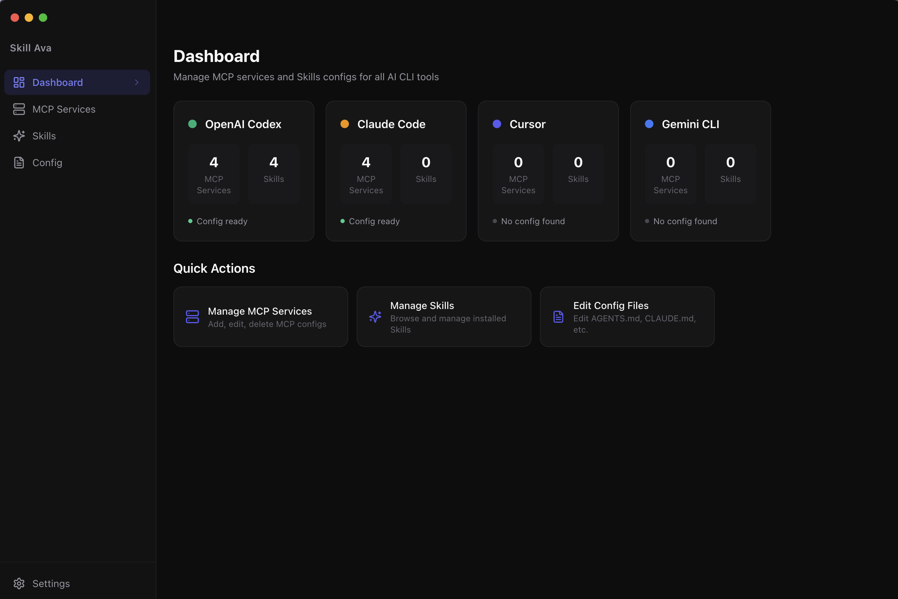

# Skill Ava

<p align="center">
  <strong>A unified desktop app for managing MCP services and Skills across AI coding tools.</strong>
</p>

<p align="center">
  <a href="./LICENSE"></a>
  
  
  
</p>

---

Skill Ava is a Mac desktop app that provides a single interface to manage configurations for **Claude Code**, **OpenAI Codex**, and **Cursor** — including their MCP (Model Context Protocol) services, Skills, and instruction files.

> 统一管理 Claude Code、Codex、Cursor 等 AI 命令行工具的 MCP 服务与 Skills 配置的桌面应用。

## Screenshots



Main workspace showing MCP service management for Codex, Claude Code, Cursor, Gemini CLI, and project-level configs.

## Features

- **Dashboard** — Overview of all tools' MCP and Skills status at a glance
- **MCP Manager** — Add / edit / delete MCP servers for Codex, Claude Code, Cursor, and project-level configs
- **Skills Manager** — Browse installed Codex & Cursor Skills, view SKILL.md details
- **Config Editor** — Directly edit `config.toml`, `settings.json`, `CLAUDE.md`, `AGENTS.md`, etc.
- **Project Folders** — Manage project-level MCP and instruction files; auto-discovers Claude Code projects from `~/.claude.json`

## Supported Tools & Config Paths

| Tool | Config Paths |
|------|-------------|
| **Codex** | `~/.codex/config.toml`, `~/.codex/AGENTS.md`, `~/.codex/skills/` |
| **Claude Code** | `~/.claude.json`, `~/.claude/settings.json`, `~/.claude/CLAUDE.md` |
| **Cursor** | `~/.cursor/mcp.json`, `~/.cursor/skills-cursor/`, `~/.cursor/rules/` |

## Tech Stack

- **Electron** — Desktop app framework
- **React 19** + **TypeScript** — UI
- **Vite** — Build tool
- **Tailwind CSS** — Styling (dark theme)
- **smol-toml** — TOML parsing
- **lucide-react** — Icons

## Prerequisites

- **Node.js** >= 18
- **npm** >= 9
- **macOS** (currently Mac-only; Windows/Linux support planned)

## Development

```bash
git clone https://github.com/freedomofme/skillava.git
cd skillava
npm install
npm run dev
```

## Build

```bash
# Type check + bundle
npm run build

# Package as .dmg (macOS)
npm run pack
```

## Scripts

| Script | Description |
|--------|-------------|
| `npm run dev` | Start dev server with HMR |
| `npm run build` | Type check + production build |
| `npm run pack` | Package as macOS .app / .dmg |
| `npm run lint` | Run ESLint |
| `npm run typecheck` | Run TypeScript type check |

## Project Structure

```
├── electron/
│   ├── main.ts          # Electron main process
│   └── preload.ts       # IPC bridge
├── src/
│   ├── pages/           # Dashboard, McpManager, SkillsManager, ConfigEditor
│   ├── components/      # Sidebar
│   ├── lib/             # Parsers, shared hooks, project folder utils
│   ├── types.ts         # TypeScript interfaces
│   └── App.tsx          # Root component
├── index.html
├── vite.config.ts
└── tailwind.config.js
```

## License

[Apache License 2.0](./LICENSE)
